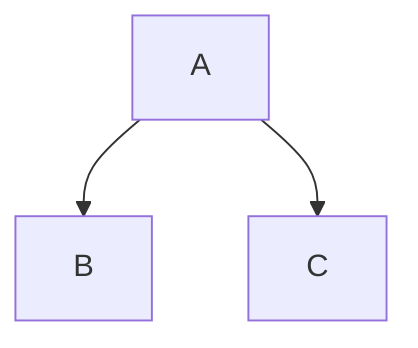
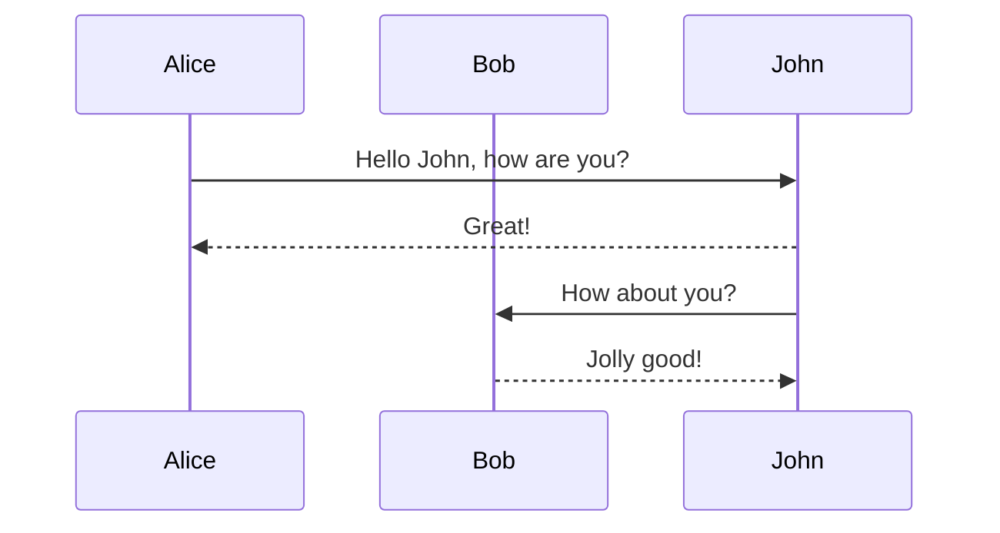

Dendron extends regular Markdown with additional syntax. This covers everything in [GitHub Flavored Markdown (GFM)](https://github.github.com/gfm/) with additional features that are unique to Dendron. Take a look at some examples in this note to see what's possible. Have the preview view opened (`Dendron: Show Preview`) to see how these will get rendered.

## Markdown Formatting Options

Markdown tables and basic formatting are made with the following syntax:

```markdown
| Formatting    |     Example     |
| :------------ | :-------------: |
| Bold          | **Hello World** |
| Italics       |  _Hello World_  |
| Strikethrough | ~~Hello World~~ |
```

The above table becomes rendered as the following, in the preview pane:

| Formatting    |     Example     |
| :------------ | :-------------: |
| Bold          | **Hello World** |
| Italics       |  _Hello World_  |
| Strikethrough | ~~Hello World~~ |

## Images

> 🌱 **ACTION:** Copy any image onto your clipboard, and then use the `Paste Image` command while focused in your editor pane. This will automatically create a link for you and copy the file contents into the assets directory in your workspace.

Sample Image Link: ``

Result:


> 💡 **TIP:** This relies on the **Dendron Paste Image** extension which is installed by default alongside Dendron. For Linux users, you'll need to have [`xclip`](https://opensource.com/article/19/7/xclip) (or [`wl-paste`](https://github.com/bugaevc/wl-clipboard) if using Wayland) installed.

## Equations

Math typesetting can be written through [Katex](https://wiki.dendron.so/notes/b1919663-cc48-4054-b0cf-4b26fe444907.html)

$$
\int_{-\infty}^\infty f(x)dx
$$

## Diagrams

Various types of diagrams are supported with the [mermaid](https://mermaid-js.github.io/mermaid/#/) visualization syntax.

### Flow Charts

````

````

<div class="mermaid">
  graph TD;
    A-->B;
    A-->C;
</div>

### Sequence Diagrams

````

````

<div class="mermaid">
  sequenceDiagram
    participant Alice
    participant Bob
    Alice->>John: Hello John, how are you?
    John-->>Alice: Great!
    John->>Bob: How about you?
    Bob-->>John: Jolly good!
</div>

## Code Blocks

Markdown provides a way to render syntax highlighting and formatting of code.

```python
# Whoa, I'm doing math in Python
result = 2 + 2
print(result)
```

The above code is in python. Both the editor view and preview view should show some syntactical flavor to the code block. You can also have code blocks with or without designated language markers.

```bash
# Whoa, this is a code block explicitly
## stating it is in bash!
echo "This is a bash example!"
ps -ef | grep codium
```

Notice how `bash` is used on the first line of the code block, and `python` on the previous code block. If missing a language marker, code blocks look like this:

```
# Whoa, this is still bash, but without
## it explicitly stated on the first line!
echo "This is a bash example!"
ps -ef | grep codium
```

## Note References

**[Note References](https://wiki.dendron.so/notes/f1af56bb-db27-47ae-8406-61a98de6c78c)** are unique to Dendron. You can embed a section of a different note, and have the content in-lined into the current note.

> 🌱 **ACTION:** Create `[[recipes.favorites]]`, if you haven't yet. We're going to add some content in here to reuse as a note reference!

Add the following contents to `[[recipes.favorites]]`:

```markdown
My favorite recipes, by far. I must avoid.

- [[recipes.italian.desserts.tiramisu]]
- [[Chinese Wontons|recipes.chinese.appetizers.wontons]]
```

In `[[recipes]]`, add the following contents:

```markdown
## Favorites

![[recipes.favorites]]
```

After completing the above, remove the surrounding backticks from the following and look in the preview view to see how this renders:

`![[recipes.favorites]]`

> 💡 **TIP:** Note references can get more fine-grained, targeting headers, sections, or blocks of text. You can learn more from the docs in [Note References](https://wiki.dendron.so/notes/f1af56bb-db27-47ae-8406-61a98de6c78c).

## Next Steps

- [[Conclude the Tutorial|tutorial.conclusion]]
