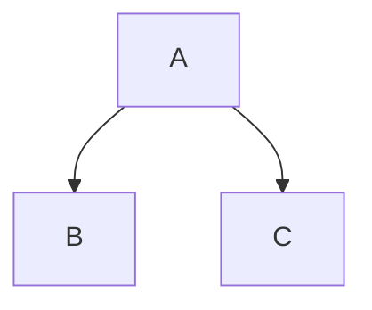
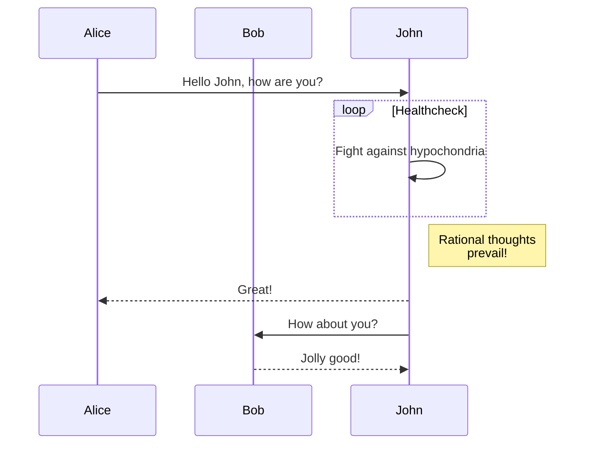

After completing this section you'll know how to create rich content within your Markdown notes.

### Images

As you may have already noticed already in the tutorial pages, you can insert images into your notes. 

> 🌱 The easiest way to do this is to first download the [Paste Image](https://marketplace.visualstudio.com/items?itemName=mushan.vscode-paste-image) extension. Once installed, copy the image onto your clipboard, and then use the `Paste Image` command into your editor pane.

This will automatically create a link for you and copy the file contents into the `\assets\images\` directory in your workspace.

You can take advantage of the rich ecosystem of extensions available to VS Code to enhance your note taking abilities within Dendron.

You can also manually place an image in the assets folder and create the link using the Markdown format below.

Sample Image Link: 

[[todo]]- get smaller image

### More Formatting Options

Besides regular markdown formatting features, there are several expanded markdown formatting options that Dendron supports. Here are some examples:

#### Math Equations

Math typesetting can be written through [Katex](https://katex.org/)

$$ f(x) = sin(x)$$

$$
\int_{-\infty}^\infty sin(x)
$$

#### Diagrams

Various types of diagrams are supported with [mermaid](https://mermaid-js.github.io/mermaid/#/).

Open the preview (`Dendron: Show Preview`) to see how these will get rendered.

##### Flow Charts

##### Sequence Diagrams

### And More!

As you can see, Markdown is a flexible and extensible format for supporting rich content in your notes. There are many other visualizations out there which you can explore.

### Next Steps

- [[Conclude the Tutorial|tutorial.5-conclusion]]
