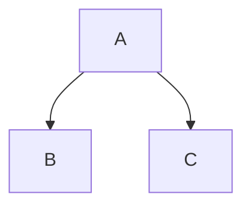
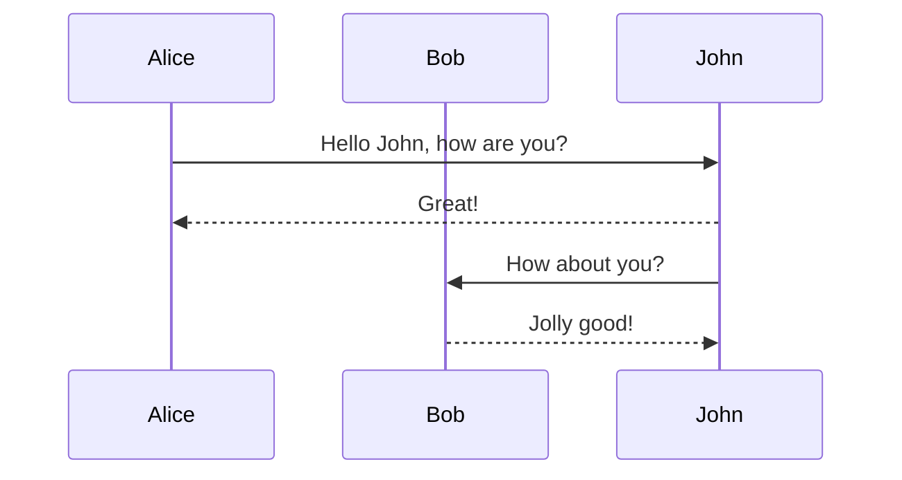

Dendron supports an extended Markdown syntax, which provides a lot of options for rich formatting. Take a look at some examples in this note to see what's possible.  Have the preview pane opened (`Dendron: Show Preview`) to see how these will get rendered.

#### Markdown Formatting Options

|Formatting|Example|
|:---|:---:|
|Bold|**Hello World**|
|Italics|_Hello World_|
|Strikethrough|~~Hello World~~|

#### Images

> 🌱 Copy any image onto your clipboard, and then use the `Paste Image` command while focused in your editor pane. This will automatically create a link for you and copy the file contents into the assets directory in your workspace.

Sample Image Link:

#### Equations

Math typesetting can be written through [Katex](https://wiki.dendron.so/notes/b1919663-cc48-4054-b0cf-4b26fe444907.html)

$$
\int_{-\infty}^\infty f(x)dx
$$

#### Diagrams

Various types of diagrams are supported with the [mermaid](https://mermaid-js.github.io/mermaid/#/) visualization syntax.

##### Flow Charts

##### Sequence Diagrams

### Note References

You can link to a specific section of a different note and have the content in-lined into the current note.

![[Join the community of Dendrologists|tutorial.5-conclusion#join-the-community-of-dendrologists:#^discord-block-ref]]

[References Docs](https://wiki.dendron.so/notes/f1af56bb-db27-47ae-8406-61a98de6c78c.html#note-reference)

### Next Steps

- [[Conclude the Tutorial|tutorial.5-conclusion]]

---
[[Tutorial Home Page| tutorial]]
