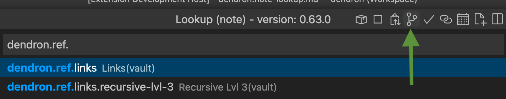

## Note look up existing notes
Note look up `cmd+l`:

### Look up note
* exact match: `dendron.welcome`
* by tokens (space works as AND): `dendron welcome`
* by tokens (| is OR): `bar | foo`

### Hierarchy with omitted path match
* `dendron.multi` should match among others:
    * `dendron.ref.frontmatter-tags.multi-array`
    
### Direct child look up:
1. Turn on direct child look up 

2. Look up `dendron.blog.` Make sure only its children are shown. 

### Go Down command
1. Navigate to `dendron.blog` 
2. Activate `Go Down` command
3. Make sure only the children of `dendron.blog` are shown.

### Just activated lookup
1. Navigate to `dendron.blog.one`
1. Activate `Note lookup`
1. Make sure to be able to see siblings of `dendron.blog.one` such as ``dendron.blog.two`.
            
### Lookup with dot at the end
1. Look up `data.` 
Should see results with roughly the following order:
* `data.driven`     
    * first show matches with `data.` exact matched and `data.` highest in hierarchy
* `languages.python.data.string`
    * then show matches that have `data.` exact matched but lower in hierarchy.
* ...
* `languages.with-data.make-sense` 
    * later show matches that are not exact matched `with-data.`
* `languages.python.data.string.memory` 
    * show matches that have not just children but grand children etc.
* `data.stub` 
    * show stubs at the end.
All matches should have `data.` and some value after `data.`

### Look up with wiki links
* [[with description with header with vault|dendron://vault/dendron.welcome#header1]]
* [[with description with header|dendron.welcome#header1]]
* [[with description|dendron.welcome]]
* [[dendron.welcome]]

## Create notes look up related
![[dendron.note-create#simple-case,1:#*]]

![[dendron.note-create#with-matching-simple-schema,1]]

## Autocomplete
### With prefix
1. Activate lookup 
2. Enter `lang` 
3. Press `Tab` multiple times to validate that look ups are auto completed one hierarchy level at time. Example:
* language
* language.python
* language.python.data
* language.python.string
* language.python.string.memory

### With part of the string that is not the beginning.
1. Activate lookup
2. Enter `pyth`
3. Press `Tab` should auto complete to `languages.pyth` 

### Focused item
1. Activate lookup
2. Enter `la`
3. Scroll down (using down arrow key) to `templates.book.characters` press tab
EXPECTED: Auto completes to `templates.book.characters`