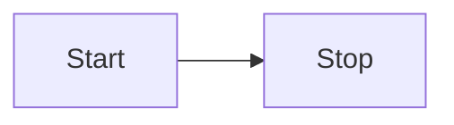

### Footnote

This is a footnote [^1]

### Syntax highlighting

```bash
ls foo
cd foobar
tar foobar
dig foo
```

```ts
function foo() {
  return "bar";
}
```

## Math

### Inline

$sin(x)$

### Block

$$
i \hbar \frac{\partial \Psi}{\partial t} = - \frac{\hbar^2}{2m} \frac{\partial^2 \Psi}{\partial x^2} + V \Psi
$$

### Todos

- [ ] this is a todo

### Mermaid



[^1]: dendron.so
